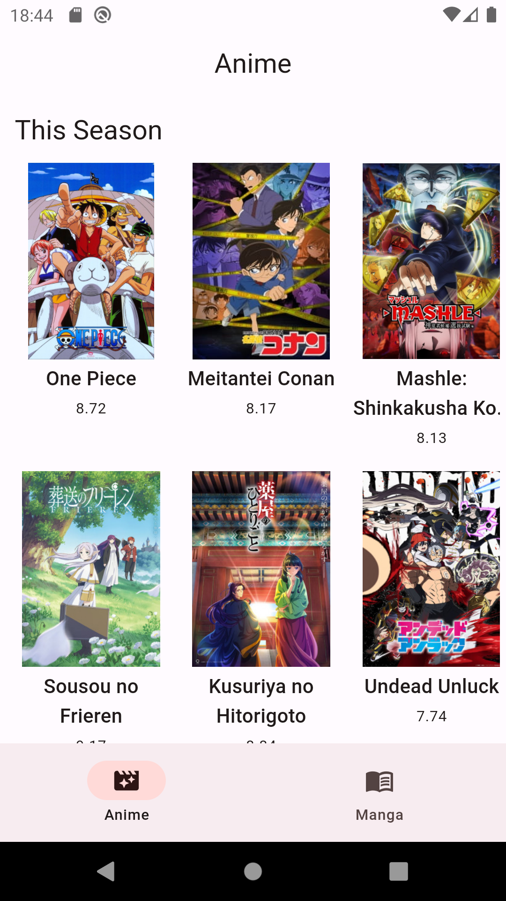
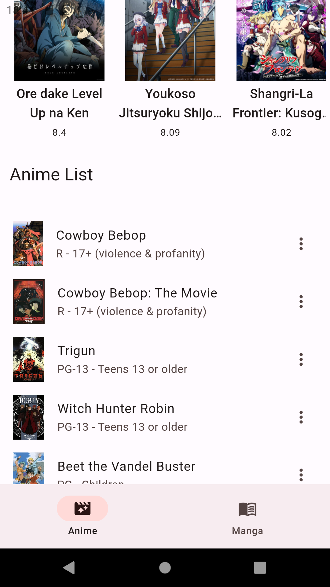
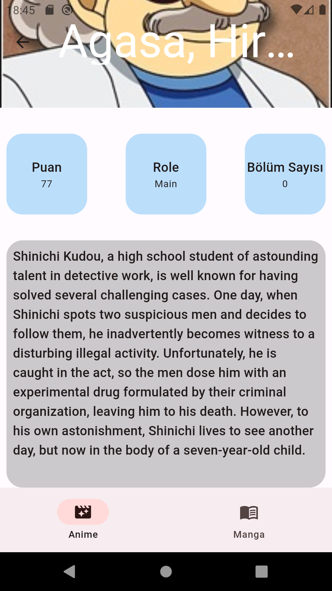
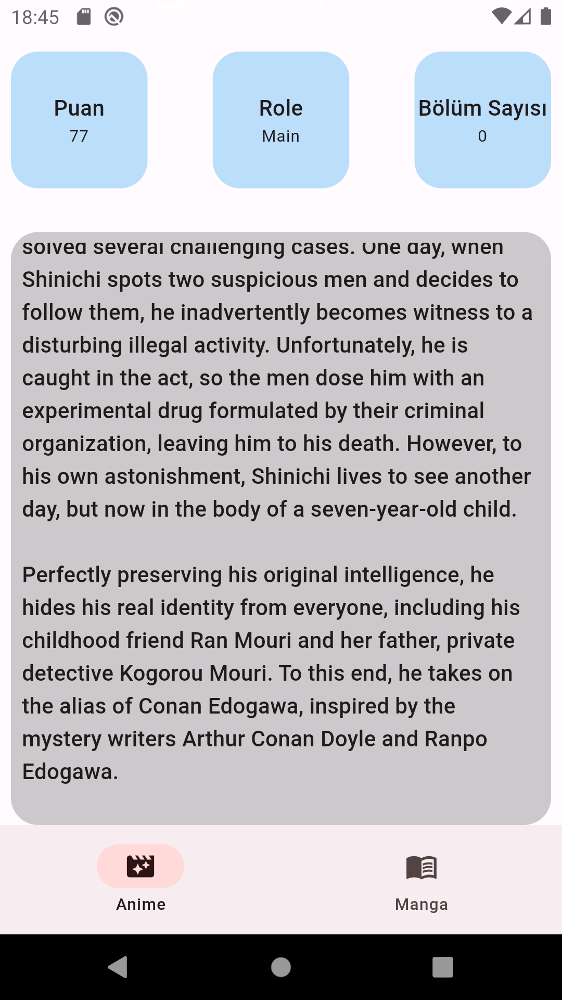

<h1 align="center">Anime</h1>

<p align="center">
  </img> 
  </img> 
  </img> 
  </img> 
  </img> 
</p>


# Proje Konusu

Bu Flutter projesi, Anime karakterleri ile ilgili çeşitli görselleri görüntülemek için oluşturulmuştur. Proje, Clean Architecture prensipleriyle tasarlanmıştır ve Bloc mimarisi kullanılarak durum yönetimi sağlanmıştır.

# Proje Yapısı
    data: Veri katmanıyla ilgili işlemleri içerir.
    domain: İş mantığı kurallarını ve modelleri içerir.
    presentation: Kullanıcı arayüzü ve görünüm katmanını içerir.
    core: Temel yardımcı işlevleri ve hizmetleri içerir.


## Kullanılan Araçlar

- [bloc](https://pub.dev/packages/flutter_bloc): Flutter uygulamaları için state management sağlayan bir paket.
- [retrofit](https://pub.dev/packages/retrofit): HTTP istekleri yapmak ve API ile iletişim kurmak için kullanılmıştır.
- [Dependency injection](https://pub.dev/packages/get_it): Bağımlılık enjeksiyonu için kullanılmıştır.
- [Dio](https://pub.dev/packages/dio): HTTP istekleri yapmak ve işlemek için kullanılan bir paket.
- [auto_route](https://pub.dev/packages/auto_route): Navigasyon için kullanılmıştır.


## Nasıl Çalıştırılır?

1. Repoyu klonlayın:

    ```bash
    git clone https://github.com/kullanici_adi/proje_adı.git
    cd proje_adı
    ```

2. Gerekli paketleri yükleyin:

    ```bash
    flutter pub get
    ```

3. Uygulamayı çalıştırın:

    ```bash
    flutter run
    ```

## Proje Gereksinimleri
    - Flutter 3.7.12 • channel stable • https://github.com/flutter/flutter.git
    - Framework • revision 4d9e56e694 (11 months ago) • 2023-04-17 21:47:46 -0400
    - Engine • revision 1a65d409c7
    - Tools • Dart 2.19.6 • DevTools 2.20.1

    Dart SDK 2.19.6
    Flutter 3.7.12
    DevTools 2.20.1


## Lisans

Bu proje [MIT Lisansı](LICENSE) ile lisanslanmıştır. Detaylar için lisans dosyasını kontrol ediniz.